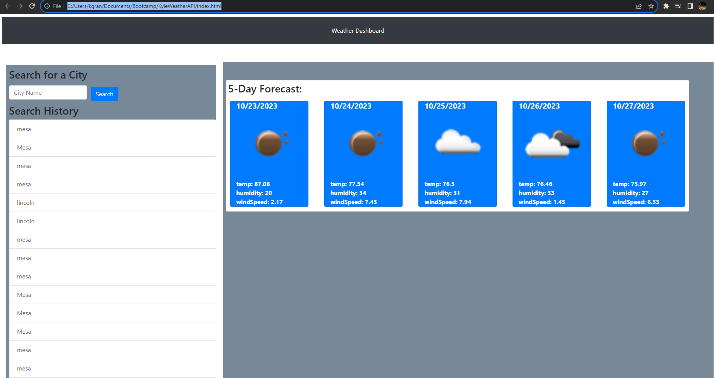

# KyleWeatherAPI
Table of Contents

-Description
-Solution/Notes
-Credits
-
Description
For this projected I created a 5-day weather app that tracked and saved previous searches

Solutions/Notes
using javascript and a 3rd party api, I was able to create a weather app that would display a five day forcase for the city that the user searched for. The app would then save the data for the user to reference at a later date.

Screenshot:

Credits
Github_Repo-"https://github.com/Kgran12/KyleGran-WorkDayScheduler"